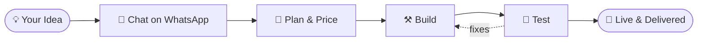

<!--
  ╔══════════════════════════════════════════════════════════╗
  ║  SETUP                                                   ║
  ║  1. Create a PUBLIC repo named exactly like your         ║
  ║     GitHub username.                                     ║
  ║  2. Upload BOTH files to it: README.md + professor.png   ║
  ║  3. Replace every  USERNAME  with your GitHub username.  ║
  ║  4. Replace 92XXXXXXXXXX with your WhatsApp number       ║
  ║     (country code, no + or spaces).                      ║
  ║  5. Replace the itch.io link with your LUDO KING page.   ║
  ╚══════════════════════════════════════════════════════════╝
-->

<div align="center">


# 𝕬𝖇𝖚 𝕾𝖚𝖋𝖞𝖆𝖓
### ✦ 𝓐𝓴𝓪 𝓟𝓡𝓞𝓕𝓔𝓢𝓢𝓞𝓡 ✦

<a href="https://git.io/typing-svg">
  
</a>

<br/><br/>

[](https://professorsufyan.vercel.app)
[](https://wa.me/92XXXXXXXXXX)


<br/>

**[🕶️ About](#-about) • [💼 Services](#-services) • [⚙️ Workflow](#%EF%B8%8F-how-i-work) • [🚀 Work](#-work) • [🛠️ Stack](#%EF%B8%8F-tech-stack) • [📊 Stats](#-github-stats) • [🌐 Website](#-my-website) • [📩 Hire Me](#-hire-me)**

</div>

---

## 🕶️ 𝗔𝗯𝗼𝘂𝘁

<table>
<tr>
<td width="60%">

```js
const professor = {
  name:      "Abu Sufyan",
  alias:     "Professor",
  role:      "Software Developer",
  focus:     ["WhatsApp Bots", "Automation Tools"],
  alsoBuild: ["Websites", "Apps"],
  pricing:   "Affordable 💸",
  website:   "professorsufyan.vercel.app",
  status:    "Open for orders ✅"
};
```

</td>
<td width="40%">

I'm a **software developer** who builds **WhatsApp bots** and **automation tools**.

I also make **websites** and **apps**, all at **budget-friendly prices**, so small businesses and individuals can get real software without a big bill.

</td>
</tr>
</table>

---

## 💼 𝗦𝗲𝗿𝘃𝗶𝗰𝗲𝘀

<div align="center">

| | Service | What you get |
|:-:|:--|:--|
| 🤖 | **WhatsApp Bots** | Custom bots built with Node.js (Baileys) to automate chats, replies and tasks |
| ⚙️ | **Automation Tools** | Scripts and tools that take over repetitive work for you |
| 🌐 | **Websites** | Clean, responsive sites deployed live on Vercel / Netlify |
| 📱 | **Apps** | Custom apps and working prototypes for your idea |
| 🧠 | **AI Assistants** | Voice / chat assistants with their own personality (like Professor AI) |

### 💸 Cheap prices • 💬 Direct chat • 🛠️ Built around your idea

</div>

---

## ⚙️ 𝗛𝗼𝘄 𝗜 𝗪𝗼𝗿𝗸



---

## 🚀 𝗪𝗼𝗿𝗸

<div align="center">

| Project | Type | Built with |
|:--|:--|:--|
| 🧠 **Professor AI** | AI voice assistant / bot | Node.js |
| 💬 **Messaging Automation** | WhatsApp automation scripts | Node.js, Baileys |
| 📍 **Geolocation Dashboard** | Tracking dashboard prototype | Web |
| 🕒 **Punch Logging System** | Office attendance logging | Node.js |
| 🖥️ **Background Services** | Windows services & unattended remote access setups | Windows, AnyDesk |
| 🎮 **[LUDO KING](https://itch.io/)** | Indie game on itch.io | Game dev |
| 🌐 **Web Prototypes** | Live demos | Vercel, Netlify |

</div>

---

## 🛠️ 𝗧𝗲𝗰𝗵 𝗦𝘁𝗮𝗰𝗸

<div align="center">


<br/><br/>


</div>

---

## 📊 𝗚𝗶𝘁𝗛𝘂𝗯 𝗦𝘁𝗮𝘁𝘀

<div align="center">


<br/>


<br/>


<br/>


</div>

---

## 🌐 𝗠𝘆 𝗪𝗲𝗯𝘀𝗶𝘁𝗲

<div align="center">

### 👉 [**professorsufyan.vercel.app**](https://professorsufyan.vercel.app) 👈

See my work, projects and services live.

[](https://professorsufyan.vercel.app)

</div>

---

## 🎯 𝗖𝘂𝗿𝗿𝗲𝗻𝘁𝗹𝘆

- 🔭 Improving **Professor AI**
- 🤖 Building more **WhatsApp bots** and **automation tools**
- 🌐 Shipping websites and apps for clients
- 🤝 **Open for orders and collaborations**

---

<div align="center">

## 📩 𝗛𝗶𝗿𝗲 𝗠𝗲

### Need a bot, tool, website or app? Let's build it. 💸 Affordable prices.

[](https://wa.me/92XXXXXXXXXX)
[](https://professorsufyan.vercel.app)
[](https://github.com/USERNAME)
[](https://itch.io/)

<br/>

*"Systems don't sleep. Neither do good ideas."* 🕶️


</div>
  
</a>

<br/><br/>


</div>

---

## 🕶️ 𝗔𝗯𝗼𝘂𝘁

```js
const professor = {
  name: "Abu Sufyan",
  role: "Software Developer",
  focus: ["WhatsApp Bots", "Automation Tools"],
  alsoBuild: ["Websites", "Apps"],
  pricing: "Affordable 💸",
  status: "Open for orders ✅",
};
```

I'm a software developer who builds **WhatsApp bots** and **automation tools**. I also make **websites** and **apps**, all at **budget-friendly prices**.

---

## 💼 𝗦𝗲𝗿𝘃𝗶𝗰𝗲𝘀

| | Service | Details |
|---|---|---|
| 🤖 | **WhatsApp Bots** | Custom bots built with Node.js (Baileys) to automate chats and replies |
| ⚙️ | **Automation Tools** | Scripts and tools that save you time on repetitive work |
| 🌐 | **Websites** | Clean, responsive sites deployed live |
| 📱 | **Apps** | Custom apps and prototypes for your idea |

<div align="center">

**💸 Affordable prices • Tell me your idea and I'll build it**

</div>

---

## 🚀 𝗪𝗼𝗿𝗸

- 🧠 **Professor AI**: custom AI voice assistant / bot
- 💬 **Messaging automation**: Node.js scripts with Baileys
- 📍 **Geolocation dashboard** prototypes
- 🕒 **Punch logging** systems
- 🎮 **[LUDO KING](https://itch.io/)**: indie game on itch.io
- 🌐 **Web prototypes** live on Vercel and Netlify

> 🔗 Replace the itch.io link with your LUDO KING page.

---

## 🛠️ 𝗧𝗲𝗰𝗵 𝗦𝘁𝗮𝗰𝗸

<div align="center">


</div>

---

## 📊 𝗚𝗶𝘁𝗛𝘂𝗯 𝗦𝘁𝗮𝘁𝘀

<div align="center">


</div>

---

<div align="center">

## 📩 𝗛𝗶𝗿𝗲 𝗠𝗲

[](https://wa.me/No3209152128)
[](https://github.com/professorsufyan)

<br/>

*"Systems don't sleep. Neither do good ideas."* 🕶️


</div>
